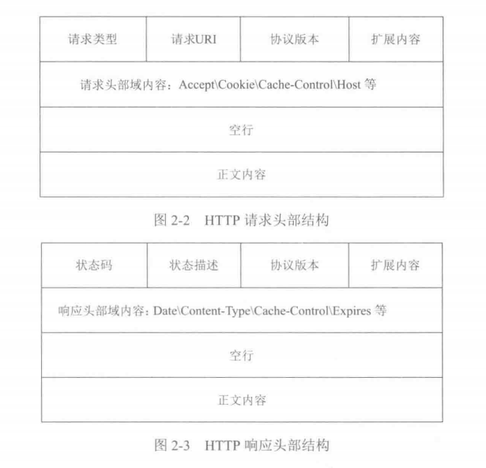

# HTTP协议

### 1.HTTP协议概述

 HTTP(超文本传输协议)是WWW服务器和用户请求代理（例如浏览器等）之间通过应答请求模式传输超文本（例如HTML文件、JavaScript文件、CSS文件、图片甚至服务器接口数据等）内容的一种协议。

通常一个HTTP报文由头部、空行、正文三部分组成。空行用于区分报文头部和报文正文，有一个回车符和一个换行符组成。

图2-2是一个HTTP请求报文的格式结构：

请求头部通常由请求类型、请求URL、协议版本和扩展内容组成；请求头中还包含其他请求头部域信息，如：Accept、Cookie、Cache-control、Host等；请求正文可以携带浏览器端请求的内容，如POST、PUT请求的表单内容。响应返回报文的格式与此类似。

图2-3为服务器的响应报文结构：

响应报文头部由状态码、状态描述、协议版本、扩展内容组成；响应头包含响应头部域信息，如Data、Content-Type、Cache-control、Expires等。服务器返回给浏览器的信息可以放在报文正文部分。

### 2.HTTP1.0

### 3.HTTP1.1

### 4.HTTP2

### 5.HTTPS

### 6.常见面试题

##### 6.1http和https的区别

（1.介绍http/https的概念->2.讲述两者区别->3.讲述https的工作原理->https的优缺点）

- http传输的数据都是未加密的，也就是明文的。https协议设置了SSL协议来对http协议传输的数据进行加密处理，简单来说https协议是由http和ssl协议构建的可进行加密传输和身份认证的网络协议，比http协议的安全性更高。
- 使用不同的链接方式，端口也不同.一般而言。http协议的端口为80，https的端口为443。
- https协议需要到ca申请证书，一般免费证书较少，因而需要一定费用。

##### 6.2https的优缺点

优点：

- 有利于SEO

  比起同等HTTP网站，采用HTTPS加密的网站在搜索结果中的排名将会更高

- 更安全，是现有架构中最安全的解决方案

  使用HTTPS协议可认证用户和服务器，确保数据发送到正确的客户机和服务器；

  HTTPS协议是由SSL+HTTP协议构建的可进行加密传输、身份认证的网络协议，要比http协议安全，可防止数据在传输过程中不被窃取、改变，确保数据的完整性。

  HTTPS是现行架构下最安全的解决方案，虽然不是绝对安全，但它大幅增加了中间人攻击的成本。

缺点：

- 使用HTTPS协议会使页面的加载时间延长近50%，增加10%到20%的耗电（因为SSL/TLS协议许需要一个握手过程）。
- HTTPS协议的加密范围也比较有限，在黑客攻击、拒绝服务攻击、服务器劫持等方面几乎起不到什么作用。
- SSL证书的信用链体系并不安全，特别是在某些国家可以控制CA根证书的情况下，中间人攻击一样可行。
- SSL证书需要钱，功能越强大的证书费用越高，个人网站、小网站没有必要一般不会用。
- SSL证书通常需要绑定IP，不能在同一IP上绑定多个域名，IPv4资源不可能支撑这个消耗。
- HTTPS连接缓存不如HTTP高效，大流量网站如非必要也不会采用，流量成本太高。

