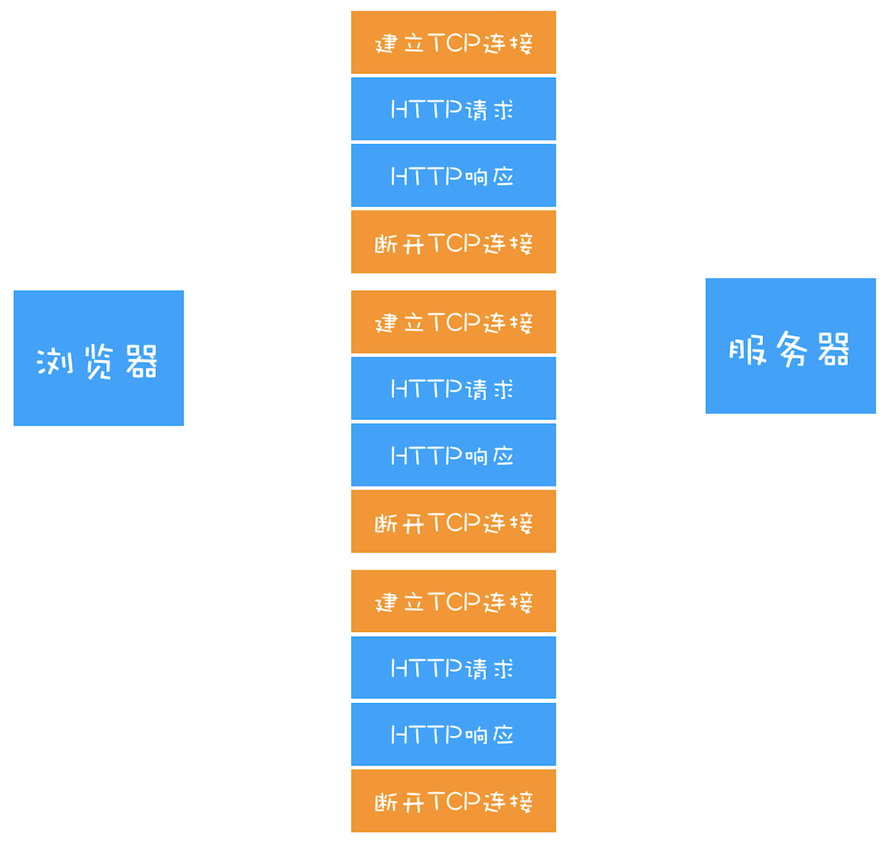

# HTTP协议

### 1.HTTP协议概述

 HTTP(超文本传输协议)是WWW服务器和用户请求代理（例如浏览器等）之间通过应答请求模式传输超文本（例如HTML文件、JavaScript文件、CSS文件、图片甚至服务器接口数据等）内容的一种协议。

通常<u>一个HTTP报文由头部、空行、正文三部分组成</u>。空行用于区分报文头部和报文正文，有一个回车符和一个换行符组成。

图2-2是一个HTTP请求报文的格式结构：

<u>请求头部通常由请求类型、请求URL、协议版本和扩展内容组成；</u>请求头中还包含其他请求头部域信息，如：Accept、Cookie、Cache-control、Host等；请求正文可以携带浏览器端请求的内容，如POST、PUT请求的表单内容。响应返回报文的格式与此类似。

图2-3为服务器的响应报文结构：

<u>响应报文头部由状态码、状态描述、协议版本、扩展内容组成</u>；响应头包含响应头部域信息，如Data、Content-Type、Cache-control、Expires等。服务器返回给浏览器的信息可以放在报文正文部分。


### 2.HTTP0.9

HTTP/0.9 是于 1991 年提出的，主要用于学术交流，需求很简单——<u>用来在网络之间传递 HTML 超文本的内容，所以被称为超文本传输协议。</u>整体来看，它的实现也很简单，采用了基于请求响应的模式，从客户端发出请求，服务器返回数据。

HTTP/0.9 的一个完整的请求流程如下：

- 因为 HTTP 都是基于 TCP 协议的，所以客户端先要根据 IP 地址、端口和服务器建立 TCP 连接，而建立连接的过程就是 TCP 协议三次握手的过程。
- 建立好连接之后，会发送一个 GET 请求行的信息，如GET /index.html用来获取 index.html。
- 服务器接收请求信息之后，读取对应的 HTML 文件，并将数据以 ASCII 字符流返回给客户端。
- HTML 文档传输完成后，断开连接。


总的来说，当时的需求很简单，就是用来传输体积很小的 HTML 文件，所以 HTTP/0.9 的实现有以下三个特点：

- 第一个是<u>只有一个请求行，并没有HTTP 请求头和请求体</u>，因为只需要一个请求行就可以完整表达客户端的需求了。
- 第二个是<u>服务器也没有返回头信息</u>，这是因为服务器端并不需要告诉客户端太多信息，<u>只需要返回数据</u>就可以了。
- 第三个是<u>返回的文件内容是以 ASCII 字符流来传输的</u>，因为都是 HTML 格式的文件，所以使用 ASCII 字节码来传输是最合适的。

**总结：只能传输HTML超文本内容**

### 3.HTTP1.0

HTTP/0.9 虽然简单，但是已经可以满足当时的需求了。首先在浏览器中展示的不单是 HTML 文件了，还包括了 JavaScript、CSS、图片、音频、视频等不同类型的文件。因此支持多种类型的文件下载是 HTTP/1.0 的一个核心诉求，而且文件格式不仅仅局限于 ASCII 编码，还有很多其他类型编码的文件。

HTTP/0.9 在建立好连接之后，只会发送类似GET /index.html的简单请求命令，并没有其他途径告诉服务器更多的信息，如文件编码、文件类型等。同样，服务器是直接返回数据给浏览器的，也没有其他途径告诉浏览器更多的关于服务器返回的文件信息。

这种简单的交流型形式无疑不能满足传输多种类型文件的需求，那为了让客户端和服务器能更深入地交流，<u>HTTP/1.0 引入了请求头和响应头，它们都是以为 Key-Value 形式保存的，在 HTTP 发送请求时，会带上请求头信息，服务器返回数据时，会先返回响应头信息</u>。至于 HTTP/1.0 具体的请求流程，你可以参考下图。


有了请求头和响应头，浏览器和服务器就能进行更加深入的交流了。

那 HTTP/1.0 是怎么通过请求头和响应头来支持多种不同类型的数据呢？

要支持多种类型的文件，我们就需要解决以下几个问题：

- 首先，<u>浏览器需要知道服务器返回的数据是什么类型的</u>，然后浏览器才能根据不同的数据类型做针对性的处理。
- 其次，由于万维网所支持的应用变得越来越广，所以单个文件的数据量也变得越来越大。<u>为了减轻传输性能，服务器会对数据进行压缩后再传输，所以浏览器需要知道服务器压缩的方法。</u>
- 再次，由于万维网是支持全球范围的，所以需要提供国际化的支持，<u>服务器需要对不同的地区提供不同的语言版本，这就需要浏览器告诉服务器它想要什么语言版本的页面。</u>
- 最后，由于增加了各种不同类型的文件，而每种文件的编码形式又可能不一样，<u>为了能够准确地读取文件，浏览器需要知道文件的编码类型。</u>

基于以上问题，HTTP/1.0 的方案是通过请求头和响应头来进行协商，在发起请求时候会通过 HTTP 请求头告诉服务器它期待服务器返回什么类型的文件、采取什么形式的压缩、提供什么语言的文件以及文件的具体编码。最终发送出来的请求头内容如下：

```js
accept: text/html	//期望服务器返回 html 类型的文件
accept-encoding: gzip, deflate, br	//期望服务器可以采用 gzip、deflate 或 br 其中的一种压缩方式
accept-Charset: ISO-8859-1,utf-8	//期望返回的文件编码是 UTF-8 或者 ISO-8859-1
accept-language: zh-CN,zh	//期望页面的优先语言是中文
```

服务器接收到浏览器发送过来的请求头信息之后，会根据请求头的信息来准备响应数据。不过有时候会有一些意外情况发生，比如浏览器请求的压缩类型是 gzip，但是服务器不支持 gzip，只支持 br 压缩，那么它会通过响应头中的 content-encoding 字段告诉浏览器最终的压缩类型，也就是说<u>最终浏览器需要根据响应头的信息来处理数据</u>。下面是一段响应头的数据信息：

```js
content-encoding: br   //表示服务器采用了 br 的压缩方法
content-type: text/html; charset=UTF-8	//表示服务器返回的是html文件，且该文件的编码类型是 UTF-8
```

有了响应头的信息，浏览器就会使用 br 方法来解压文件，再按照 UTF-8 的编码格式来处理原始文件，最后按照 HTML 的方式来解析该文件。这就是 HTTP/1.0 支持多文件的一个基本的处理流程。

HTTP/1.0 除了对多文件提供良好的支持外，还依据当时实际的需求引入了很多其他的特性，这些特性都是通过请求头和响应头来实现的。下面我们来看看新增的几个典型的特性:

- 有的请求服务器可能无法处理，或者处理出错，这时候就需要告诉浏览器服务器最终处理该请求的情况，这就引入了<u>状态码</u>。状态码是通过响应行的方式来通知浏览器的。
- 为了减轻服务器的压力，在 HTTP/1.0 中<u>提供了Cache 机制</u>，用来缓存已经下载过的数据。
- 服务器需要统计客户端的基础信息，比如 Windows 和 macOS 的用户数量分别是多少，所以 HTTP/1.0 的请求头中还<u>加入了用户代理</u>的字段

**总结：**

- **支持多文件传输（html、css、js、音视频等）**
- **通过响应行的方式引入了状态码**
- **提供了cache机制（Expires头部控制）**
- **加入了用户代理**
- **不支持持久连接，规定浏览器与服务器保持较短时间的连接，每次请求都经过三次握手**
- **可以支持长连接，默认请求的服务器返回是没有keep-alive的。但是想要长连接，可以在请求消息中包含connection:keep-alive头域信息实现长连接**

### 4.HTTP1.1

不过随着技术的继续发展，需求也在不断迭代更新，很快 HTTP/1.0 也不能满足需求了，所以 HTTP/1.1 又在 HTTP/1.0 的基础之上做了大量的更新。接下来我们来看看 HTTP/1.0 遇到了哪些主要的问题，以及 HTTP/1.1 又是如何改进的。

##### 4.1.改进持久连接（长连接）

HTTP/1.0 每进行一次 HTTP 通信，都需要经历建立 TCP 连接、传输 HTTP 数据和断开 TCP 连接三个阶段（如下图）。



为了解决这个问题，HTTP/1.1 中增加了持久连接的方法，它的特点是在一个 TCP 连接上可以传输多个 HTTP 请求，只要浏览器或者服务器没有明确断开连接，那么该 TCP 连接会一直保持。


从上图可以看出，HTTP 的持久连接可以有效减少 TCP 建立连接和断开连接的次数，这样的好处是减少了服务器额外的负担，并提升整体 HTTP 的请求时长。例如有n个文件的连续请求，每个文件请求建立和关闭连接的开销为ams (毫秒)，那么完全使用HTTP 1.0 协议完成所有文件请求的额外开销就为nxams，而使用HTTP 1.1协议来进行文件传输额外开销仅为ams。 但是需要注意的是，长连接的请求机制并不会节省传输内容的网络开销。

持久连接在 HTTP/1.1 中是默认开启的，任何HTTP请求的报文头部域都会默认包含keep-alive。所以你不需要专门为了持久连接去 HTTP 请求头设置信息，如果你不想要采用持久连接，可以在 HTTP 请求头中加上Connection: close。<u>目前浏览器中对于同一个域名，默认允许同时建立 6 个 TCP 持久连接。</u>

##### 4.2不成熟的HTTP管道化

持久连接虽然能减少 TCP 的建立和断开次数，但是它需要等待前面的请求返回之后，才能进行下一次请求。如果 TCP 通道中的某个请求因为某些原因没有及时返回，那么就会阻塞后面的所有请求，这就是著名的<u>队头阻塞</u>的问题。

HTTP/1.1 中试图通过管线化的技术来解决队头阻塞的问题。HTTP/1.1 中的管线化是指将多个 HTTP 请求整批提交给服务器的技术，虽然可以整批发送请求，不过服务器依然需要根据请求顺序来回复浏览器的请求。

FireFox、Chrome 都做过管线化的试验，但是由于各种原因，它们最终都放弃了管线化技术。


##### 4.3协议扩展转换

协议扩展切换是指，HTTP1.1 协议支持在请求头部域消息中包含Upgrade头并让客户端通过头部标识令服务器知道它能够支持其他备用通信协议的一种机制，服务器根据客户端请求的其他协议进行切换，切换后使用备用协议与客户端进行通信。

例如WebSocket协议就是典型的应用，WebSocket 协议通信是通过HTTP的方式来建立的，通信连接建立完成后通知服务器切换到WebSocket协议来完成后面的数据通信。

图2-4为WebSocket协议的连接建立过程,浏览器(假设用户使用的浏览器支持WebSocket)向服务端发送请求，并在消息头中添加Connection: Upgrade 和Upgrade: websocket告诉服务器后面需要进行协议切换，切换成为WebSocket 协议进行通信，如果服务端支持WebSocket服务并允许该客户端来连接，则可以在响应报文头中返回Upgrade和Connection消息头域，同意浏览器使用WebSocket来连接，同时返回的状态码为101表示请求还需要完成协议的切换。


##### 4.4缓存控制

> 绝对时间：强调信息发布的具体精确时间点
>
> 相对时间：指距离信息发布时间点的的相对时长，如年、月、周、日、分钟以前。

在HTTP1.1版本之前，浏览器缓存主要是通过对HTTP 1.0的Expires头部控制来实现的，我们知道Expires只能根据绝对时间来刷新缓存内容，HTTP 1.1增加了Cache-Control 头域，可以支持max-age用来表示相对过期时间，另外请求服务器时也可以根据Etag 和Last- Modified来判断是否从浏览器端缓存中加载文件，此时缓存的控制和判断将决定服务器的响应报文中头部内容的状态码200还是304。下面来看一个浏览器发送HTTP请求时进行缓存读取判断的流程。

如图2-5所示，浏览器发起请求时，头部域字段的判断过程主要如下所述。

1.浏览器会先查询Cache-Control (这里用Expires 判断也是可以的，但是Expires - -般设置的是绝对过期时间，在HTTP 1.1之前较为通用，Cache-Control设置的是相对过期时间，HTTP1.1后推荐使用Cache-Control来控制，如果两者都设置了，则只有Cache-Control的设置生效)来判断内容是否过期，如果未过期，则直接读取浏览器端缓存文件，不发送HTTP请求，否则进入下一步。

2.在浏览器端判断上次文件返回头中是否含有Etag信息，有则带上If-None-Match字段信息发送请求给服务器，服务端判断Etag未修改则返回304，如果修改则返回200，否则进入下一步。

3.在浏览器端判断上次文件返回头中是否含有Last-Modified 信息，有则带上If-Modified-Since字段信息发送请求，服务端判断Last-Modified 失效则返回200，有效则返回304。

4.如果Etag和Last-Modified都不存在，则直接向服务器请求内容。

这就是Cache-Control、Etag 和Last-Modifed控制请求缓存的主要过程。


##### 4.5部分内容传输优化

部分内容传输优化指HTTP可以支持超文本文件的部分传输，例如，它允许请求一个文件的起始位置和一个偏移长度来进行文件内容的部分传输。HTTP/1.1 通过引入Chunk transfer 机制（允许HTTP由应用服务器发送给客户端应用（ 通常是网页浏览器）的数据可以分成多个部分）来解决这个问题，服务器会将数据分割成若干个任意大小的数据块，每个数据块发送时会附上上个数据块的长度，最后使用一个零长度的块作为发送数据完成的标志。这样就<u>提供了对动态内容的支持</u>。

另外HTTP1.1请求允许携带一些参数信息一起发送到服务器，请求时的数据信息可以放在请求头(例如，GET、DELETE方法请求时)或正文(例如，POST、PUT方法请求时)中。HTTP请求在消息的正文中除了可以携带文本内容，也<u>可以传输二 进制数据</u>，例如表单中使用formData提交上传文件时携带的就是二进制数据。

##### 4.6提供虚拟主机的支持

在 HTTP/1.0 中，每个域名绑定了一个唯一的 IP 地址，因此一个服务器只能支持一个域名。但是随着虚拟主机技术的发展，需要实现在<u>一台物理主机上绑定多个虚拟主机，每个虚拟主机都有自己的单独的域名，这些单独的域名都公用同一个 IP 地址</u>。

因此，HTTP/1.1 的请求头中增加了Host 字段，用来表示当前的域名地址，这样服务器就可以根据不同的 Host 值做不同的处理。

##### 4.7客户端引入Cookie、安全机制

除此之外，HTTP/1.1 还引入了客户端 Cookie 机制和安全机制。

**总结：**

- **默认包含keep-alive，拥有长连接机制**
- **通过管线化的技术来解决队头阻塞的问题，但是是不成熟的**
- **支持协议扩展转换**
- **增加更完善的缓存控制**
- **内容传输优化（支持部分传输、可以传输二进制）**
- **提供虚拟主机的支持、增加host字段**
- **引入Cookie安全机制**	

### 5.HTTP2

### 7.HTTPS

### 7.常见面试题

##### 7.1http和https的区别

（1.介绍http/https的概念->2.讲述两者区别->3.讲述https的工作原理->https的优缺点）

- http传输的数据都是未加密的，也就是明文的。https协议设置了SSL协议来对http协议传输的数据进行加密处理，简单来说https协议是由http和ssl协议构建的可进行加密传输和身份认证的网络协议，比http协议的安全性更高。
- 使用不同的链接方式，端口也不同.一般而言。http协议的端口为80，https的端口为443。
- https协议需要到ca申请证书，一般免费证书较少，因而需要一定费用。

##### 7.2https的优缺点

优点：

- 有利于SEO

  比起同等HTTP网站，采用HTTPS加密的网站在搜索结果中的排名将会更高

- 更安全，是现有架构中最安全的解决方案

  使用HTTPS协议可认证用户和服务器，确保数据发送到正确的客户机和服务器；

  HTTPS协议是由SSL+HTTP协议构建的可进行加密传输、身份认证的网络协议，要比http协议安全，可防止数据在传输过程中不被窃取、改变，确保数据的完整性。

  HTTPS是现行架构下最安全的解决方案，虽然不是绝对安全，但它大幅增加了中间人攻击的成本。

缺点：

- 使用HTTPS协议会使页面的加载时间延长近50%，增加10%到20%的耗电（因为SSL/TLS协议许需要一个握手过程）。
- HTTPS协议的加密范围也比较有限，在黑客攻击、拒绝服务攻击、服务器劫持等方面几乎起不到什么作用。
- SSL证书的信用链体系并不安全，特别是在某些国家可以控制CA根证书的情况下，中间人攻击一样可行。
- SSL证书需要钱，功能越强大的证书费用越高，个人网站、小网站没有必要一般不会用。
- SSL证书通常需要绑定IP，不能在同一IP上绑定多个域名，IPv4资源不可能支撑这个消耗。
- HTTPS连接缓存不如HTTP高效，大流量网站如非必要也不会采用，流量成本太高。


